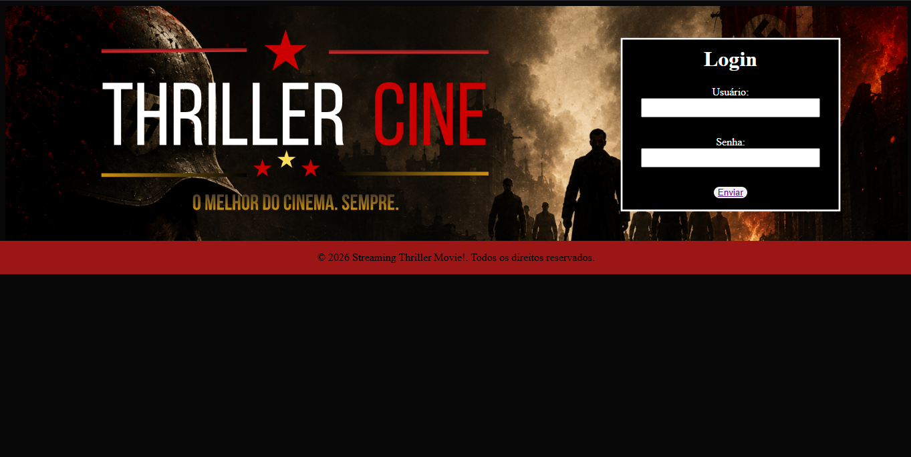

<h1 align="center"># 🎬 ThrillerCine</h1>

<p align="center">


</p>

<p align="center">Um site inspirado em plataformas de streaming desenvolvido com HTML e CSS durante o 2º ano do Ensino Médio.
</p>

---

## 📸 Preview



---

## 🎯 Objetivo

Este projeto foi desenvolvido para praticar HTML e CSS durante o 2º ano do Ensino Médio, simulando uma plataforma de streaming inspirada na Netflix.

---


## 📖 Sobre

O ThrillerCine é um projeto criado para praticar HTML e CSS, simulando uma plataforma de streaming de filmes.

---

## ✨ Funcionalidades

- 🔐 Tela de login
- 🎬 Catálogo de filmes
- 📖 Página individual para cada filme
- 🚪 Tela de logout

---

## 🛠 Tecnologias utilizadas

- HTML5
- CSS3

---

## 📂 Estrutura do projeto

```
assets/
index.html
home.html
style.css
README.md
```

---

## 🚀 Como executar

1. Baixe o projeto.
2. Abra o arquivo `index.html` no navegador.

---

## 📚 O que aprendi

Durante este projeto pratiquei:

- Estruturação de páginas HTML
- Organização de arquivos
- CSS para estilização
- Navegação entre páginas
- Organização de um projeto Front-end

---

## 👨‍💻 Autor

Pietro Klaoss Neumann

Estudante de Engenharia de Software.

GitHub:
https://github.com/pietroneumann

---

⭐ Se gostou do projeto, deixe uma estrela no repositório.